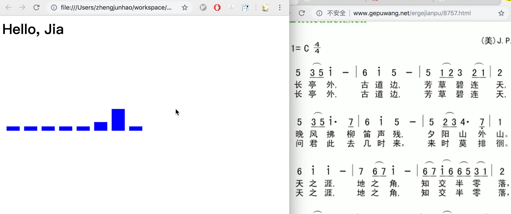

# PianoPlayer

You can play it by accessing [https://leteno.github.io/PianoPlayer/](https://leteno.github.io/PianoPlayer/)

## Keymapping:

|Key|sound|
| :---: | :---: |
|A|do|
|S|re|
|D|mi|
|F|fa|
|J|so|
|K|la|
|L|si|
|;|doh|

## TODO
- [ ] Add doh sound, I cannot find it.
- [ ] Add more effects:
	- [x] make bar rolling from left to right;
	- [ ] waving effects just like Microsoft Media Player
