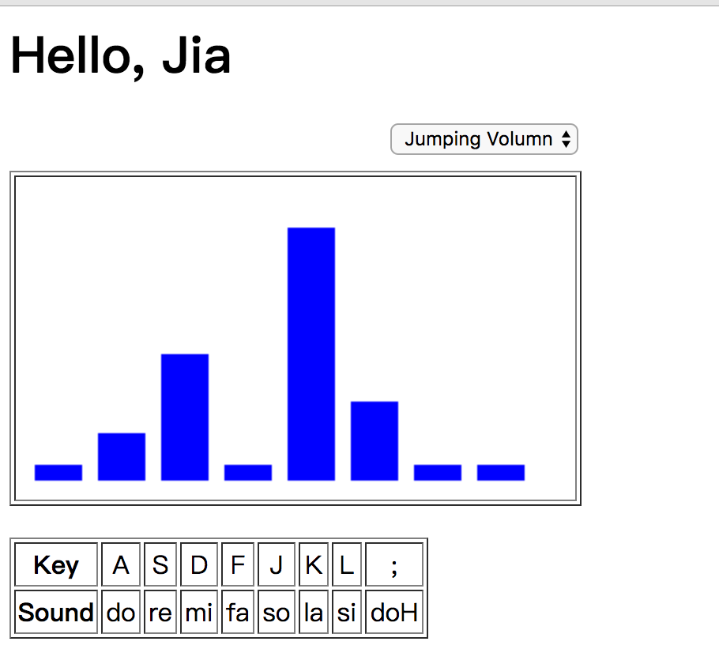

# PianoPlayer

You can play it by accessing [https://leteno.github.io/PianoPlayer/](https://leteno.github.io/PianoPlayer/)

## Keymapping:

|Key|Sound|Key|Sound|Key|Sound|
| :---: | :---: | :---: | :---: | :---: | :---: |
|Q|doH|A|do|Z|doL|
|W|reH|S|re|X|reL|
|E|miH|D|mi|C|miL|
|R|faH|F|fa|V|faL|
|U|soH|J|so|M|soL|
|I|laH|K|la|,|laL|
|O|siH|L|si|.|siL|

## TODO
- [ ] Add doh sound, I cannot find it.
- [ ] Add more effects:
	- [x] make bar rolling from left to right;
	- [ ] waving effects just like Microsoft Media Player
